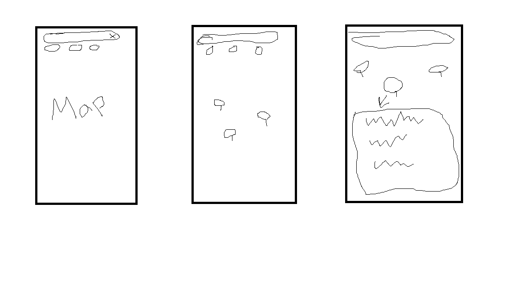

# PriceFinder

A college Project 1 prototype for finding everyday products and comparing prices on a map. Search a product, compare price bubbles, and open a store card for details. Built with Expo SDK 57, React Native, TypeScript, and Expo Router.

## Run on your phone with Expo Go

1. Install Expo Go on your iPhone or Android phone (SDK 57 compatible).
2. Open a terminal in this `price_app` directory.
3. Run `npm install`, then `npm start`.
4. Connect your computer and phone to the same Wi-Fi network.
5. Scan the terminal QR code with the iPhone Camera app or the QR scanner in Expo Go on Android.
6. Allow foreground location access to center the map on your position. Denying it still lets you use the St. George area.

If LAN access is blocked by the network/firewall, try `npx expo start --tunnel` and follow the CLI prompt to install its tunnel helper. If Expo Go reports an SDK mismatch, check the compatible download at https://expo.dev/go.

Tap **St. George stores** to see the seven selected real store locations from anywhere. **My location** returns to your actual position. Distances are straight-line miles from your location, or explicitly from the St. George center when location is unavailable. Store chips let you select each result in sorted order.

`npm run web` offers search, filters, cards, and details in a browser; the interactive native map requires Expo Go on iOS/Android. Web intentionally displays a fallback instead of importing unsupported native map code. Map tiles and retailer websites need internet; product data is local.

## Project concept and scope

PriceFinder borrows the map-first shopping flow of a property or marketplace app, with prices displayed directly on store markers. The prototype contains eight products (including bananas priced per pound) and dozens of listings across Walmart, Target, Smith’s, Albertsons, Costco, Walgreens, and Maverik.

**Map locations and addresses correspond to real St. George branches listed below.** Prices marked **DEMO** and their stock values are fictional. Prices marked **ONLINE** come from the manually imported retailer snapshot, with an observation timestamp and source product URL. They are not verified prices or inventory for the mapped branch. There is no backend, database, scheduled job, account, purchase flow, or background location tracking. The Expo app never scrapes websites.

## Store locations

These seven branches were checked on September 19, 2026. Addresses and coordinates come from the retailers’ store pages and their embedded location metadata, except Smith’s coordinates, which were cross-checked against the location directories linked below. The app uses one selected branch per retailer, not every branch in town.

| Store           | Address                                       | Latitude, longitude    | Location source                                                                                                             |
| --------------- | --------------------------------------------- | ---------------------- | --------------------------------------------------------------------------------------------------------------------------- |
| Walmart #3220   | 2610 Pioneer Rd, St. George, UT 84790         | 37.063426, -113.587387 | [Walmart store page](https://www.walmart.com/store/3220-st-george-ut)                                                       |
| Target #1357    | 275 S River Rd, St. George, UT 84790          | 37.102987, -113.554468 | [Target store page](https://www.target.com/sl/st-george-store/1357)                                                         |
| Smith’s #00189  | 20 N Bluff St, St. George, UT 84770           | 37.108826, -113.591472 | [Smith’s store page](https://www.smithsfoodanddrug.com/stores/grocery/ut/saint-george/20-n-bluff-st-st-george-ut/706/00189) |
| Albertsons      | 745 N Dixie Dr, St. George, UT 84770          | 37.120872, -113.624581 | [Albertsons store page](https://local.albertsons.com/ut/saint-george/745-n-dixie-dr.html)                                   |
| Costco #672     | 835 N 3050 E, St. George, UT 84790            | 37.122303, -113.522490 | [Costco warehouse page](https://www.costco.com/w/-/ut/st-george/672)                                                        |
| Walgreens #7052 | 391 W Saint George Blvd, St. George, UT 84770 | 37.109579, -113.591421 | [Walgreens store page](https://www.walgreens.com/locator/walgreens-391-w-saint-george-blvd-saint-george-ut-84770/id=7052)   |
| Maverik #521    | 995 E St George Blvd, St. George, UT 84770    | 37.110499, -113.562758 | [Maverik store page](https://locations.maverik.com/ut/st.-george/995-e-st-george-blvd)                                      |

Smith’s coordinate references: [ScrapeHero location listing](https://www.scrapehero.com/location-reports/Smith%27s%20Food%20and%20Drug-USA/) and [MerchantCircle map listing](https://www.merchantcircle.com/smith-s1-saint-george-ut). Pins use published store coordinates, not surveyed entrance locations. Correct store locations do not establish that a demo product is sold there or that an imported online price applies to that branch.

## Manually import online prices on Windows

From the `price_app` directory, use Node.js 24 LTS (the tested version):

```powershell
npm install
npx playwright install chromium
npm run scrape-prices
npm start
```

The browser install is only needed once per Playwright browser version. `npm run scrape-prices` runs a standalone local TypeScript script and exits. It checks **Monster Energy Original 12 × 16 fl oz** and **Coca-Cola Original 12 × 12 fl oz** at Walmart, Target, and Smith’s (the Kroger-family retailer used here). The six predefined product URLs are in `scripts/price-targets.ts`; these can be updated if a retailer changes a page.

The script tries regular HTTP and Cheerio HTML parsing first. If a page needs JavaScript to render its price, it uses an isolated headless Playwright browser. It reads the main product price or a matching USD Product structured offer, verifies pack size/flavor, and skips ambiguous offers instead of using an unrelated price, unit price, or another variant. It does not log in, bypass access challenges, or use your personal browser profile. Pages that require a selected store and still provide no unambiguous price are logged and skipped; there is no automatic store selection.

Optional HTTP-only mode (no browser launch):

```powershell
npm run scrape-prices -- --http-only
```

Results are written to **`data/scraped-prices.json`** as an array of `productId`, `retailer`, `storeId`, `productName`, `price`, `url`, `inStock`, and `updatedAt` records. Prices are USD. Availability is `true`, `false`, or `null` when unavailable; unknown values are not treated as in stock. The In stock filter excludes unknown availability.

The existing product service merges each valid result into its matching product/store listing. Coordinates, addresses, and listing IDs stay in `src/data/listings.ts`; `storeId` is our stable local identifier, **not a retailer branch ID**. The legacy `-demo` suffix is retained to preserve existing imports; it no longer indicates a fictional location. The app shows **“Price checked today”** only when the saved observation is dated today in the phone’s local timezone. Older observations show their date, and demo data is never labeled freshly checked. Online availability refers to the retailer page’s context, not local stock. Taxes, shipping, membership discounts, and conditional multi-buy promotions are not calculated.

Each failed lookup logs a reason and continues. A previously successful record keeps its original price and timestamp when its refresh fails; stores with no successful import keep demo data. A temporary file is renamed into place only after processing, so an interrupted scrape cannot truncate the existing JSON. A malformed existing file stops the script before making requests or overwriting it. The command exits with code 1 if no lookups succeed, and code 0 if at least one succeeds; always read the per-retailer summary.

Run this before starting Expo. If Expo is already running, stop and restart it to bundle the new snapshot (use `npx expo start --clear` if an old snapshot persists). There is no network refresh inside the app. To return to all demo prices, replace the JSON contents with `[]` and restart Expo.

**First verified import, September 19, 2026:** Walmart returned $21.58 for Monster and $7.68 for Coca-Cola; Target returned $23.99 and $8.89. Walmart exposed online availability; Target availability was unknown. Smith’s returned HTTP 403 for both products and was skipped. These are observations from that run, not promised future prices or St. George shelf prices. Website changes and access restrictions can make later runs fail.

Search is case-insensitive substring matching. Submitting selects the exact match first, then a prefix match, then the shortest matching name. It is not typo correction. Unknown products show “No products found.” Cheapest and Closest change result order; In stock filters unavailable listings immediately. The large preview starts closed. Tapping a marker or store chip opens its preview. Tapping empty map space dismisses the preview and suggestions while keeping the search text and map results. The search bar × clears the text and dismisses the preview; map results remain available to explore.

## Packages used

- **expo-location** — used to obtain the user's current location, with foreground permission and a demo fallback on denial/error/timeout.
- **expo-web-browser** — used to open store websites from details, with loading/error feedback.
- **react-native-maps** — used for interactive native maps and custom price markers.
- **expo-router** — file-based navigation and product/listing route parameters.
- **react-native-safe-area-context** — safe spacing around device cutouts.
- **expo-status-bar**, **expo-linking**, **expo-constants**, **react-native-screens** — Expo navigation/platform support.
- **react-native-reanimated**, **react-native-worklets** — SDK-compatible Router peer dependencies.
- **react-native-web**, **react-dom** — optional browser preview.
- **cheerio**, **playwright**, **tsx** — development-only tools for the manual local importer; not imported by the Expo screens or service layer.

Expo Go supplies the native map integration. Standalone store builds may require map provider configuration/API keys; they are outside this assignment.

## Structure

```text
src/app/_layout.tsx         Router stack
src/app/index.tsx           Map/search screen and interaction state
src/app/product/[id].tsx    Details, validates product + listing route IDs
src/components/            Search, suggestions, filters, map, marker, card
src/data/                  Separate mock products and store listings
src/services/              Async product repository and location handling
src/types/                 Shared data models
src/theme.ts               Shared colors and styles
scripts/scrape-prices.ts    Manual PC-only importer
scripts/price-targets.ts    Six predefined retailer product pages
scripts/parse-price.ts      Product/price parsing without network access
data/scraped-prices.json    Saved online observations bundled with the app
tests/                     Search, repository, import, parser, and distance tests
```

The screens use async repository functions (`searchProducts`, `getProductById`, `getListingsForProduct`, `getListingById`), not raw data arrays. Replace those service implementations with backend calls later. Location handling has its own service. Effects cancel stale updates when inputs change or screens unmount.

## Assignment rubric

| Requirement               | Implementation                                                              |
| ------------------------- | --------------------------------------------------------------------------- |
| Two screens / data passed | Explore → `/product/[id]?listingId=…` with product and listing identifiers  |
| useState / useEffect      | Search, filters, selected store, async product and location loading         |
| View / Text / Pressable   | Reusable cards, map controls, buttons, details                              |
| User input and feedback   | TextInput, suggestions, no-match message, selected bubbles, stock filters   |
| Two extra Expo packages   | expo-location and expo-web-browser                                          |
| Reusable components       | Dedicated search, map, marker, filter, and product card components          |
| Professional appearance   | Forest green palette, floating rounded cards, safe areas, keyboard handling |

## LOW-FIDELITY WIREFRAMES



From left to right: the initial map with search and filters, the map with product price markers, and the store preview shown after selecting a marker.

## APP SCREENSHOTS

Placeholder: add phone screenshots under `docs/screenshots/` for the map, search suggestions, selected store, and product details. No phone screenshots are included yet.

## Checks

```sh
npm run typecheck
npm run lint
npm test
npx expo install --check
npx expo-doctor
```

Phone smoke test: grant/deny location; search `mon`; submit `bananas`; submit `milk`; search an unknown item; select a marker then tap empty map space (text stays, card closes); select again then press × (text and card clear); tap each marker; change sort and stock filter; open details and the store website; go back; use St. George stores and My location. Test with the keyboard visible and on a small screen. Native map rendering and OS permission/browser prompts need a real phone or emulator.

Verified during implementation: TypeScript, ESLint, nine tests, all 21 Expo Doctor checks, SDK dependency compatibility, and Android/iOS/web export. Browser checks covered stock filtering, partial search, Enter selection, no-match feedback, and details navigation. Import tests cover exact pack matching, current versus old/unit prices, bad JSON rows, store matching, unknown stock, and freshness labels. Native phone testing remains to be done.

Dependency note: npm currently reports 13 moderate advisories in the Expo/Router dependency chains (no high or critical findings). Its suggested automatic fixes downgrade Expo/Router to incompatible major versions, so those were not applied. Recheck when updating the SDK.
